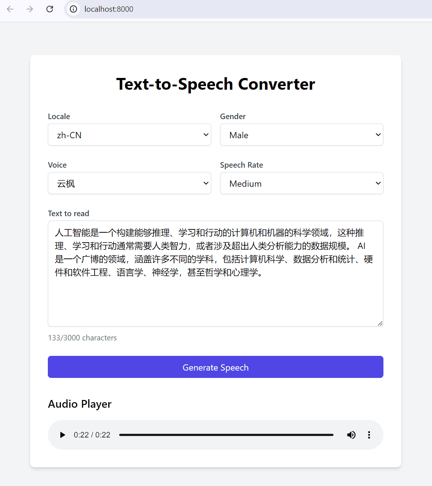

# Azure Text-to-Speech FastAPI Server

This project is a web-based text-to-speech converter that utilizes the Azure Cognitive Services Speech SDK to synthesize speech from text input. The application allows users to select a locale, gender, voice, and speech rate, and then generates an audio output of the provided text.



Based on the provided `app.py`, `index.html`, and the screenshot, here's a suggested `README.md` file for your text-to-speech converter project:

## Features

- Select from a variety of locales and languages
- Choose between male and female voices
- Adjust the speech rate (slow, medium, fast)
- Enter up to 3000 characters of text to be converted to speech
- Listen to the generated audio directly in the browser

## Technologies Used

- Python
- FastAPI
- Azure Cognitive Services Speech SDK
- Vue.js
- Tailwind CSS

## Setup and Installation

1. Clone the repository:

   ```
   git clone https://github.com/your-username/text-to-speech-converter.git
   ```

2. Install the required Python packages:

   ```
   pip install -r requirements.txt
   ```

3. Set up your Azure Cognitive Services Speech resource and obtain the subscription key and region.

4. Create a `.env` file in the project root and add your Azure Speech key and region:

   ```
   AZURE_SPEECH_KEY=your_speech_key
   AZURE_SPEECH_REGION=your_speech_region
   ```

5. Run the FastAPI server:

   ```
   uvicorn app:app --host localhost --port 8000
   ```

6. Open your web browser and navigate to `http://localhost:8000` to access the Text-to-Speech Converter.

## Usage

1. Select a locale and gender from the dropdown menus.
2. Choose a voice from the available options based on the selected locale and gender.
3. Adjust the speech rate using the "Speech Rate" dropdown.
4. Enter the text you want to convert to speech in the "Text to read" textarea.
5. Click the "Generate Speech" button to synthesize the speech.
6. The generated audio will be played automatically in the audio player below.

## Contributing

Contributions are welcome! If you find any issues or have suggestions for improvements, please open an issue or submit a pull request.

## License

This project is licensed under the [MIT License](LICENSE).
